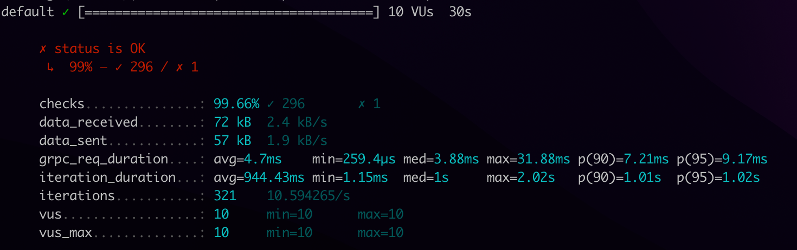
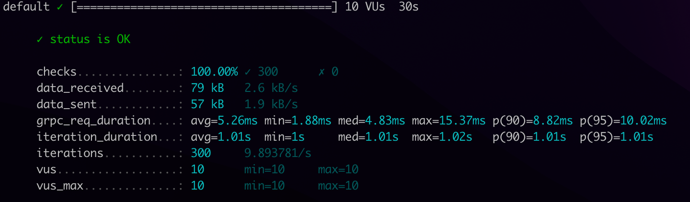

# Description

> **DISCLAIMER**: This performance test is by no means exhaustive. I'll leave it you to improve it.

This is just a boilerplate for those who want to play around with multiple grpc servers proxied by nginx and envoy.
To be more specific, I just want to quickly measure the performance of nginx vs. that of envoy in load balancing gRPC traffic by using k6 as shown below.


                       ┌────────────┐                ┌────────────────┐
                       │            │                │                │
             ┌────────►│  nginx:80  ├──┬────────────►│ gserver1:50051 │
             │         │            │  │             │                │
             │         └────────────┘  │  ┌─────────►└────────────────┘
          ┌──┴─┐                       │  │
          │    │                       │  │
          │ k6 │                       │  │
          │    │                       │  │
          └──┬─┘                       │  │
             │         ┌─────────────┐ └──┼─────────►┌────────────────┐
             │         │             │    │          │                │
             └────────►│ envoy:8080  ├────┴─────────►│ gserver2:50051 │
                       │             │               │                │
                       └─────────────┘               └────────────────┘


# How to run

- run:
```
docker-compose up --build -d
```
- run for testing the nginx scenario:
```
docker exec -it k6 k6 run -e MY_HOSTNAME=nginx:80 script.js
```
- run for testing the envoy scenario:
```
docker exec -it k6 k6 run -e MY_HOSTNAME=envoy:8080 script.js
```

## Manual test

In case you want to manually test it, you can go to the grpc directory, install the package.json, and run the greeter_client.js. That is,

```
cd grpc
npm install
node greeter_client.js --target localhost:8000 # for nginx scenario
node greeter_client.js --target localhost:8080 # for envoy scenario
```

# Results

Examples of results can be seen as follows.
- Nginx scenario

- Envoy scenario


Short conclusions (default settings):
- More dropped connections if we use nginx.
- On average, the envoy duration is slightly longer, but envoy has smaller max req duration compared to nginx

